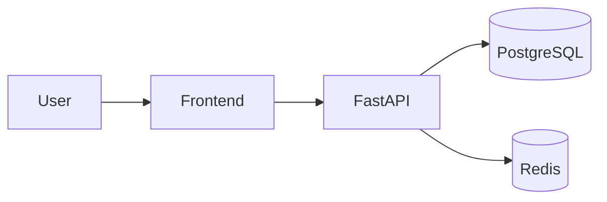

# 🗣 Natural Language Communicator (NNC)

A full-stack LLM communicator deployed on AWS.  
**Stack:** FastAPI · PostgreSQL (pgvector) · Redis · Docker · Terraform (EC2, IAM, VPC) · GitHub Actions (CI/CD)


> ✨ Purpose: make it easy to interact with LLMs over a cloud-hosted, scalable backend with caching and infrastructure-as-code.

---

## 📐 Architecture



---
## 🚀 Quickstart (Local Dev)

```bash
# 1) Clone
git clone https://github.com/AhmadK005/Natural-Language-Communicator.git
cd Natural-Language-Communicator

# 2) Setup environment
cp .env.example .env   # fill in secrets

# 3) Run with Docker
docker compose up --build
```

---

## 🗂 Repo Layout

    .
    ├─ backend/           # FastAPI app (routes, services, models)
    │  ├─ app/
    │  └─ requirements.txt
    ├─ infra/             # Terraform (EC2, IAM, VPC, RDS)
    │  ├─ main.tf
    │  ├─ variables.tf
    │  └─ outputs.tf
    ├─ frontend/          # React chat UI (optional)
    │  └─ package.json
    ├─ docker/            # Dockerfiles / compose configs
    │  └─ docker-compose.yml
    ├─ .github/
    │  └─ workflows/
    │     └─ ci.yml
    ├─ docs/              # diagrams, benchmarks, screenshots
    │  └─ architecture.png
    ├─ .env.example
    ├─ .gitignore
    ├─ LICENSE
    └─ README.md


